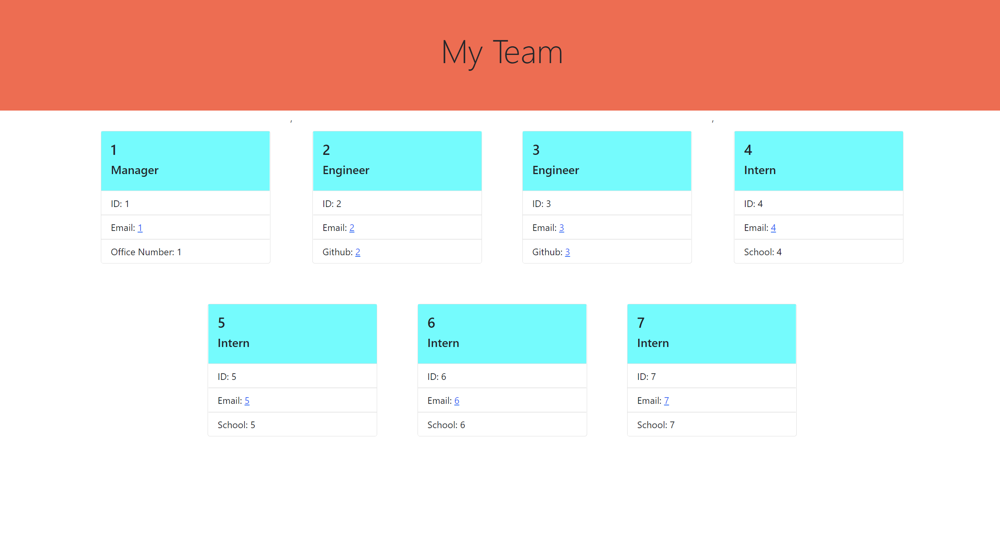

# Team Profile Generator

  ## Table of Contents
  [Description](##-description)

  [Usage](##-usage)

  [Credits](##-credits)

  [Features](##-features)

  [How to Contribute](##-how-to-contribute)

  ## Description
  
  - Allows members of a team to be documented as cards displaying their role (be it Manager, Engineer, or Intern), their name, employee ID, email, and other role-specific details. Enables the user to contact everyone onboarded as well as be able to see the role of the specific person and thus know who is the best candidate for whatever task or question the user has in mind. Tests are also included to ensure sustainabiliity of code.
  
  ## Usage
  
  - Run "node index" from the console with the files saved on your local machine. Follow the prompts to list out as many employees as is needed and the information will be displayed in the appropriate areas.
  
  ## Credits
  [https://github.com/MarloweMich](https://github.com/MarloweMich)   

  ## Features

  Responsive Design   Easy access to email any employee   Quickly accessible links to all engineers github homepages   
  
  ## How to Contribute 
  
  - Make a pull request to get involved"

  

  
  

  